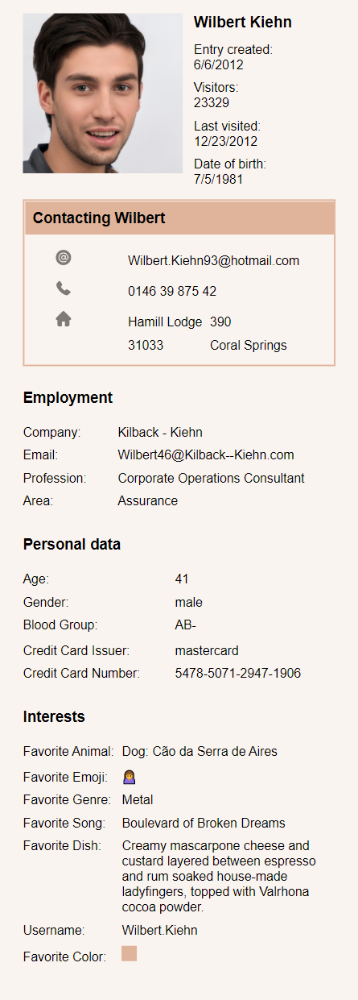

# thepoolroom

An Art project for friends to generate fake images and matching personal data for a personnal file.  
The files are displayed as static generated Sites under https://poolroom.neocities.org/*. The simple Style of the pages is inspired by _myspace_ pages.

## Example

|                                                         |
| :-----------------------------------------------------------------------------------------------: |
| <b>_Wilbert Kiehn - https://poolroom.neocities.org/c9e7caa1-1ac2-4017-8d09-c0296174e8e9.html_</b> |

An overview of all generated Sites can be found under https://poolroom.neocities.org/.

## Requirements

- Node.js 16.x
- Python3
- pip3
