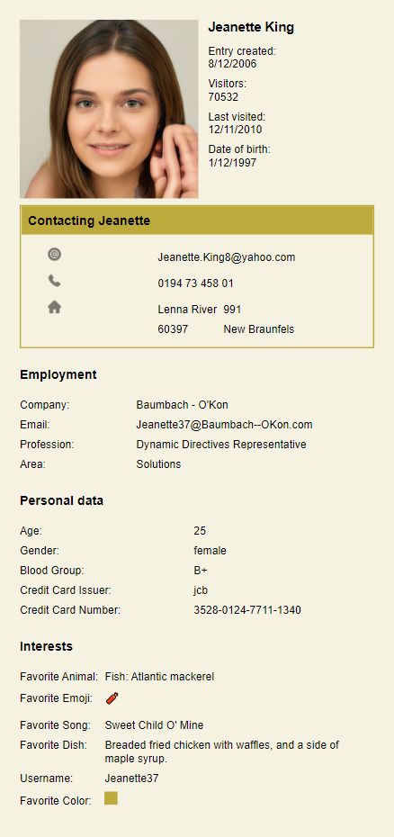

# thepoolroom

An Art project for friends to generate fake images and matching personal data for a personnal file.  
The files are displayed as static generated Sites under https://poolroom.neocities.org/*.

## Example

|                                                         |
| :-----------------------------------------------------------------------------------------------: |
| <b>_Jeanette King - https://poolroom.neocities.org/b0d1aabe-60fe-4889-9ee6-623bd0eddb95.html_</b> |

An overview of all generated Sites can be found under https://poolroom.neocities.org/.

## Requirements

- Node.js 16.x
- Python3
- pip3
